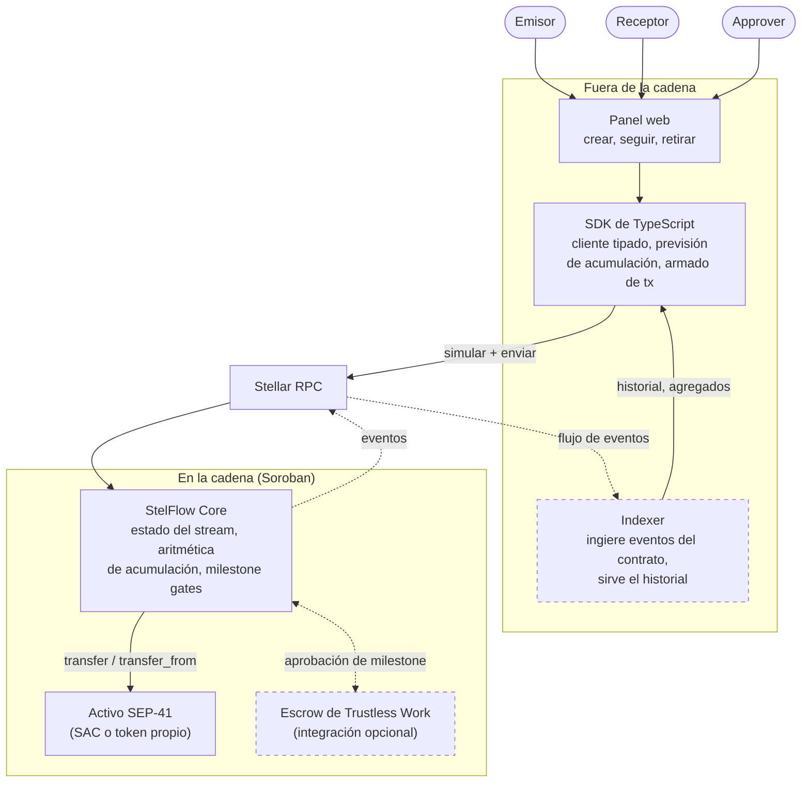

<p align="center">
  <picture>
    <source media="(prefers-color-scheme: dark)" srcset="assets/banner-dark.svg">
    
  </picture>
</p>

<p align="center">
  <a href="README.md">English</a> · <a href="README.es.md">Español</a>
</p>

# StelFlow

> **Nota sobre esta traducción.** La produjo una herramienta de IA, no una
> persona hispanohablante nativa. El original en inglés es la referencia
> autoritativa: si algo aquí lo contradice, el inglés manda. Las correcciones son
> muy bienvenidas — ver [issue #12](https://github.com/StelFlow-labs/StelFlow/issues/12).

StelFlow es un protocolo de streaming de pagos para Stellar/Soroban: quien envía
bloquea una vez un activo SEP-41, y el saldo de quien recibe se acumula de forma
continua contra el tiempo del ledger de Stellar, en lugar de llegar como
transferencias sueltas. A diferencia de un stream puramente temporal, StelFlow
puede retener partes de un stream detrás de milestones: los fondos siguen
acumulándose, pero no pueden retirarse hasta que un approver designado verifica
la condición.

> **Estado: MVP funcionando en testnet. Sin auditar.**
>
> El contrato está escrito, probado y **desplegado en la testnet de Stellar** en
> [`CBUWKI66…NRL7`](https://stellar.expert/explorer/testnet/contract/CBUWKI666QTSYUSPWNGWN6HIE3EB6NHDQ3BDCACAT2ADQFCOYU57NRL7),
> con un panel que ejecuta todas sus operaciones. Sus 75 tests pasan.
>
> **No ha habido ninguna auditoría y no hay nada desplegado en mainnet.** No
> pongas valor real en esto. El contrato es deliberadamente no actualizable, lo
> que significa que un fallo encontrado más adelante no podría corregirse — algo
> que eleva lo que está en juego en la auditoría pendiente, no lo contrario. Ver
> [SECURITY.md](docs/SECURITY.md).

## Por qué existe

Stellar liquida rápido y barato, y tiene una historia sólida con stablecoins,
pero transferir valor de forma recurrente sigue siendo un problema de
planificación. Hoy, o envías pagos periódicos desde un bot o un multisig de
tesorería, o guardas los fondos en un escrow que los libera de golpe tras una
aprobación. Lo primero exige un firmante activo y confiar en que alguien siga
pagando; lo segundo no le da nada a quien recibe hasta que se libera el tramo
completo.

EVM lleva años con streaming continuo — Sablier es la implementación de
referencia, y sobre ella crecieron herramientas de vesting, nóminas y
subvenciones. Soroban tiene primitivas de escrow (en particular
[Trustless Work](https://docs.trustlesswork.com/)), pero no una primitiva general
de streaming por debajo. StelFlow pretende ser esa primitiva, con algo que el
streaming puro no cubre: la mayoría de los desembolsos reales no dependen solo
del tiempo. Una subvención depende del tiempo *y* de una condición. Un calendario
de vesting tiene un cliff. Quien colabora con una DAO cobra a lo largo del
trimestre, pero el último tramo depende de entregar.

Así que StelFlow combina tres cosas que normalmente viven en contratos separados:

- **Acumulación continua** — el saldo reclamable de quien recibe es una función
  del tiempo del ledger, calculada al leer, no empujada por un calendario.
- **Milestone gates** — un segmento del stream puede quedar retenido hasta que un
  approver marque su milestone como cumplido. La acumulación continúa; el retiro
  no.
- **Cancelación y [clawback](docs/glossary.md#clawback-stelflow-sense)** — quien
  envía puede detener un stream y recuperar el remanente *no transmitido*. Lo ya
  acumulado se queda con quien recibe.

Usos previstos: desembolso de subvenciones, nóminas de DAO y vesting con cliffs —
los casos donde un escrow de suma única es demasiado tosco y un cron job
demasiado frágil.

### Qué existe ya en Stellar

Esta sección afirmaba que los proyectos de streaming sobre Soroban eran «MVPs a
escala de hackathon». **Era falso, y el estudio que lo comprobó es
[docs/comparison.md](docs/comparison.md).**

Dos proyectos nativos de Soroban —
[StellarStream](https://github.com/StellarStream-HQ/StellarStream) y
[stellar-stream](https://github.com/ritik4ever/stellar-stream) — están en
desarrollo activo: ambos recibieron cambios en la semana previa a la fecha del
estudio y ambos mantienen programas de colaboración considerables. Ninguno está
abandonado y ninguno merecía esa descripción.

Lo que sí se sostuvo es más concreto: **ninguno implementa milestones aprobados
por un tercero designado.** Ambos son streaming lineal por tiempo con
cancelación. Tampoco lo hace [Sablier](https://docs.sablier.com/), la referencia
en EVM: sus streams «tranched» se liberan por reloj, no por una firma, que es un
mecanismo distinto con un nombre parecido.

Así que la afirmación honesta es una característica, no una categoría: StelFlow
retiene tramos detrás de un approver designado, y nada de lo estudiado hace eso.
Todo lo demás está muy transitado. La tabla completa, incluido dónde StelFlow
*no* debe atribuirse una ventaja, está en [el estudio](docs/comparison.md).

## Arquitectura



**Los componentes con línea continua están construidos y funcionando en testnet.**
Los punteados no: no hay indexer (el panel lee directamente el registro de
eventos de Stellar RPC, que conserva una ventana móvil y no el historial
completo), y la integración con Trustless Work es una intención de diseño sin
código y sin conversación previa con ellos. [docs/architecture.md](docs/architecture.md)
explica cada componente y por qué las restricciones de Soroban le dan esta forma.

## Stack

| Capa | Elección | Notas |
|---|---|---|
| Contratos | Rust + `soroban-sdk` | Compilado al target `wasm32v1-none`; requiere Rust 1.84+ |
| Activos | Interfaz de token SEP-41 | Funciona con el Stellar Asset Contract (SAC) y cualquier token SEP-41 |
| Herramientas | Stellar CLI (`stellar`) | Antes `soroban-cli`; `stellar contract build`, `stellar contract deploy` |
| Panel | Next.js 16 + Tailwind 4 | App Router, Stellar Wallets Kit para Freighter y compañía |
| Indexer | **no construido** | El panel procesa `getEvents` de RPC directamente. [docs/indexer-design.md](docs/indexer-design.md) especifica el servicio para cuando eso deje de bastar |

## Documentación

- [docs/concepts.md](docs/concepts.md) — qué significan realmente el streaming de
  dinero y los milestone gates, desde cero.
- [docs/architecture.md](docs/architecture.md) — componentes, flujo de datos y las
  restricciones de Soroban que guían el diseño.
- [docs/glossary.md](docs/glossary.md) — todos los términos en un solo sitio. Empieza
  aquí si llegaste a mitad de un documento. Ojo:
  [clawback](docs/glossary.md#clawback-issuer-sense) significa dos cosas distintas
  en este proyecto.
- [ROADMAP.md](docs/ROADMAP.md) — qué se construye y en qué orden.
- [docs/faq.md](docs/faq.md) — respuestas breves a lo que la gente pregunta de
  verdad, incluidas las incómodas: no, no está auditado; y sí, el emisor de un
  activo con clawback activado puede alcanzar un stream en marcha.
- [docs/behaviour.md](docs/behaviour.md) — las especificaciones Given/When/Then,
  escritas antes que el código para que los tests no pudieran amoldarse a él.
- [docs/comparison.md](docs/comparison.md) — un estudio honesto de lo que ya
  existe, incluido dónde el README de este propio proyecto estaba equivocado.
- **Casos de uso**: [nóminas de DAO](docs/use-case-dao-payroll.md),
  [subvenciones](docs/use-case-grant-disbursement.md),
  [vesting con cliffs](docs/use-case-vesting.md).
- **Decisiones de diseño**: [modelo de amenazas](docs/threat-model.md),
  [actualizabilidad y pausa](docs/upgradeability-and-pause.md),
  [revocación de milestones](docs/milestone-revocation.md),
  [plazos de milestones](docs/milestone-deadlines.md),
  [estrategia de TTL](docs/ttl-strategy.md).

## Inicio rápido

```bash
# 1. Herramientas
rustup target add wasm32v1-none      # Rust 1.84+
brew install stellar-cli             # o: cargo install --locked stellar-cli
pnpm install

# 2. Contrato: 75 tests y luego una compilación a Wasm
pnpm contract:test
pnpm contract:build

# 3. Panel contra el contrato desplegado en testnet
pnpm dev                             # http://localhost:3000
```

Para usar el panel necesitas [Freighter](https://www.freighter.app/) (o
cualquier wallet compatible con el kit) configurado en **testnet**, con una
cuenta financiada:

```bash
stellar keys generate --global alice --network testnet --fund
```

Guía completa de pruebas de principio a fin: [TESTING.md](TESTING.md).

## Contribuir

Lee [CONTRIBUTING.md](docs/CONTRIBUTING.md). En resumen: los issues etiquetados
`good first issue` están acotados para poder terminarse sin leer todo el diseño;
comenta en uno antes de empezar para que dos personas no lo escriban a la vez.
Los comentarios sobre el diseño en `docs/` son bienvenidos como issue.

Quienes contribuyen aparecen en [CONTRIBUTORS.md](docs/CONTRIBUTORS.md).

## Quién construye esto

Mantenido por [@jayteemoney](https://github.com/jayteemoney), que antes construyó
[**StackStream**](https://github.com/jayteemoney/stackstream), un protocolo de
streaming de pagos sobre Stacks — unas 1.100 líneas de Clarity en dos contratos,
con suite de tests y una revisión de seguridad documentada.

Su revisión de seguridad se llevó a cabo como un proceso abierto con varios
auditores: 11 personas independientes a lo largo de cuatro PRs y un hilo de
issues, que encontraron y corrigieron cuatro fallos reales, incluidos una vía de
recuperación ausente y dos vectores de griefing. Esa revisión está
[publicada íntegra](https://github.com/jayteemoney/stackstream/tree/main/audits),
con falsos positivos y hallazgos aplazados incluidos. StelFlow pretende funcionar
igual, y por eso sus issues llevan criterios de aceptación y
[SECURITY.md](docs/SECURITY.md) describe un proceso de divulgación.
