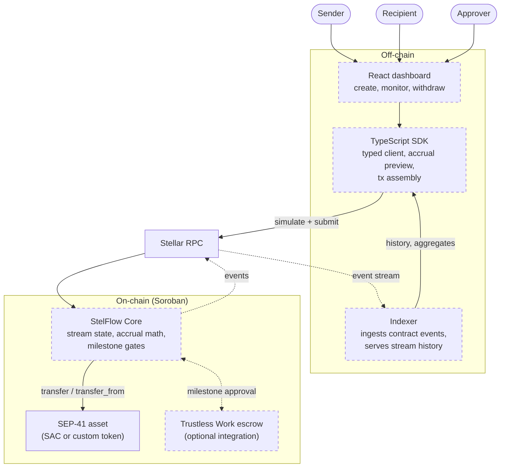

# StelFlow

StelFlow is a payment-streaming protocol for Stellar/Soroban: a sender locks a SEP-41 asset once, and the recipient's balance accrues continuously against Stellar ledger time instead of arriving as discrete transfers. Unlike a pure time-based stream, StelFlow can gate portions of a stream behind milestones, so funds keep accruing but stay unwithdrawable until a named approver verifies the condition.

> **Status: early / in design.**
> No contracts are written yet. There is no deployment, no audit, and no published contract address. This repository currently holds the design, the roadmap, and the contribution setup. Everything described below as "planned" is exactly that. If you are here to contribute, [CONTRIBUTING.md](CONTRIBUTING.md) is the place to start — design review and API critique are genuinely useful right now, more so than code.

## Why this exists

Stellar has fast, cheap settlement and a native stablecoin story, but recurring value transfer on it is still a scheduling problem. Today you either send periodic payments from a bot or a treasury multisig, or you hold funds in an escrow that releases in a lump on approval. The first requires a live signer and trust that someone keeps paying; the second gives the recipient nothing until the whole tranche clears.

EVM has had continuous streaming for years — Sablier is the reference implementation, and vesting, payroll, and grant tooling grew on top of it. Soroban has escrow primitives (notably [Trustless Work](https://docs.trustlesswork.com/)) but no general streaming primitive underneath them. StelFlow is meant to be that primitive, with one addition that pure streaming lacks: most real disbursements are not purely time-based. A grant is time-based *and* conditional. A vesting schedule has a cliff. A DAO contributor gets paid over the quarter but the last tranche depends on shipping.

So StelFlow combines three things that usually live in separate contracts:

- **Continuous accrual** — the recipient's claimable balance is a function of ledger time, computed on read, not pushed on a schedule.
- **Milestone gates** — a stream segment can be held until an approver marks its milestone met. Accrual continues; withdrawal does not.
- **Cancel and clawback** — the sender can stop a stream and recover the *unstreamed* remainder. Already-accrued funds stay with the recipient.

Target uses: grant disbursement, DAO payroll, and vesting with cliffs — the cases where a lump-sum escrow is too coarse and a cron job is too fragile.

### What already exists on Stellar

A few payment-streaming projects exist in the Soroban ecosystem, mostly hackathon-scale MVPs implementing linear time-based streaming. They demonstrate the primitive works. None of them, as far as we can tell, combine milestone gating, cancellation with clawback of unstreamed funds, and an escrow integration path — and none are audited or in production use.

That's a claim that needs checking rather than asserting, so it's [an open issue](../../issues) for a contributor to survey properly and write up honestly. If the survey finds something that already does this well, that's worth knowing before more is built, and the finding gets published either way.

## Architecture



Dashed components are planned and unbuilt. [docs/architecture.md](docs/architecture.md) explains each one and why Soroban's constraints shape it the way they do.

## Stack

| Layer | Choice | Notes |
|---|---|---|
| Contracts | Rust + `soroban-sdk` | Built to the `wasm32v1-none` target; needs Rust 1.84+ |
| Assets | SEP-41 token interface | Works with the Stellar Asset Contract (SAC) and any SEP-41 token |
| Tooling | Stellar CLI (`stellar`) | Formerly `soroban-cli`; `stellar contract build`, `stellar contract deploy` |
| SDK | TypeScript + `@stellar/stellar-sdk` | Typed bindings generated from the contract spec |
| Dashboard | React | <!-- TODO(maintainer): confirm framework — Next.js vs Vite — before the dashboard phase opens --> |
| Indexer | <!-- TODO(maintainer): pick runtime + datastore (e.g. TypeScript + Postgres) and record it here --> | Ingests contract events via Stellar RPC |

## Docs

- [docs/concepts.md](docs/concepts.md) — what money streaming and milestone-gating actually mean, from zero.
- [docs/architecture.md](docs/architecture.md) — components, data flow, and the Soroban constraints that drive the design.
- [ROADMAP.md](ROADMAP.md) — what gets built, in what order.

## Quickstart

> Nothing is implemented yet, so there is nothing to run. This section records the toolchain contributors will need and will grow into a real quickstart as Phase 1 lands. See [CONTRIBUTING.md](CONTRIBUTING.md#local-setup) for the full setup.

```bash
# 1. Rust toolchain and the Wasm target
rustup install stable
rustup target add wasm32v1-none

# 2. Stellar CLI
cargo install --locked stellar-cli

# 3. A funded testnet identity
stellar keys generate --global alice --network testnet --fund

# 4. Build and test the contracts  (planned — no crates in this repo yet)
# stellar contract build
# cargo test
```

The intended developer flow once Phase 1 exists: build the Wasm, deploy to testnet, create a stream, advance ledger time in tests, withdraw, and assert accrual matches the closed-form math. Nothing in that list works today.

## Contributing

Read [CONTRIBUTING.md](CONTRIBUTING.md). Short version: issues labeled `good first issue` are scoped to be finishable without reading the whole design; comment on one before you start so two people don't write it twice. Design feedback on `docs/` is welcome as an issue — at this stage a good argument against the storage layout is worth more than a PR.

Contributors are credited in [CONTRIBUTORS.md](CONTRIBUTORS.md).

## Who's building this

Maintained by [@jayteemoney](https://github.com/jayteemoney), who previously built [**StackStream**](https://github.com/jayteemoney/stackstream), a payment-streaming protocol on Stacks — around 1,100 lines of Clarity across two contracts, with a test suite and a documented security review.

Two things from that project carry directly into this one.

The first is design experience: the accrual math, the cancellation semantics, and a withdrawal API that had to be redesigned once are lessons applied here rather than learned again.

The second matters more if you're deciding whether to contribute. StackStream's security review was run as an open multi-auditor process — 11 independent contributors across four PRs and an issue thread, which found and fixed four real bugs including a missing recovery path and two griefing vectors. That review is [published in full](https://github.com/jayteemoney/stackstream/tree/main/audits), false positives and deferred findings included. StelFlow intends to work the same way, which is why the issues here are scoped with acceptance criteria and why [SECURITY.md](SECURITY.md) already describes a disclosure process for a project with nothing to disclose yet.

StackStream is a separate codebase, not a preview of this one. Clarity and Rust/Soroban differ enough in storage model, fee model, and asset interface that porting was never on the table. Most of what makes StelFlow's design specific — the persistent-storage choice, TTL archival handling, the milestone cap forced by the per-transaction read budget — answers Soroban constraints that have no Stacks equivalent.

<!-- TODO(maintainer): two things to check before a reviewer does.
     1. StackStream has a mainnet deployment *plan* but that isn't the same as being deployed. If it IS live, state that plainly and link the contract. If it isn't, don't let "shipped" imply mainnet — the repo is strong enough without the claim.
     2. StackStream has no LICENSE file, which technically makes it all-rights-reserved and undercuts an open-source track record. Add Apache-2.0 or MIT to it; five minutes, and it's the first thing a careful reviewer notices. -->

## License

Apache-2.0. See [LICENSE](LICENSE).
