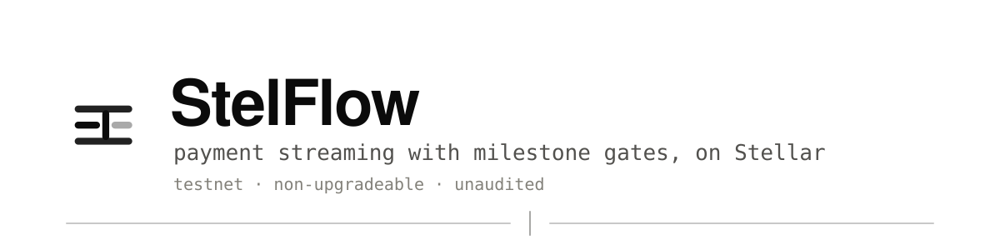

<p align="center">
  <picture>
    <source media="(prefers-color-scheme: dark)" srcset="assets/banner-dark.svg">
    
  </picture>
</p>

<p align="center">
  <a href="README.md">English</a> · <a href="README.es.md">Español</a>
</p>

# StelFlow

StelFlow is a payment-streaming protocol for Stellar/Soroban: a sender locks a SEP-41 asset once, and the recipient's balance accrues continuously against Stellar ledger time instead of arriving as discrete transfers. Unlike a pure time-based stream, StelFlow can gate portions of a stream behind milestones, so funds keep accruing but stay unwithdrawable until a named approver verifies the condition.

> **Status: working MVP on testnet. Unaudited.**
>
> The contract is written, tested, and **live on Stellar testnet** at
> [`CBUWKI66…NRL7`](https://stellar.expert/explorer/testnet/contract/CBUWKI666QTSYUSPWNGWN6HIE3EB6NHDQ3BDCACAT2ADQFCOYU57NRL7),
> with a dashboard that drives every entry point. 75 contract tests pass.
>
> **There has been no audit, and nothing is deployed to mainnet.** Do not put real
> value in this. The contract is non-upgradeable by design, which means a bug in
> it cannot be fixed — that raises the stakes on the audit that has not happened
> yet. See [SECURITY.md](docs/SECURITY.md).

## Why this exists

Stellar has fast, cheap settlement and a native stablecoin story, but recurring value transfer on it is still a scheduling problem. Today you either send periodic payments from a bot or a treasury multisig, or you hold funds in an escrow that releases in a lump on approval. The first requires a live signer and trust that someone keeps paying; the second gives the recipient nothing until the whole tranche clears.

EVM has had continuous streaming for years — Sablier is the reference implementation, and vesting, payroll, and grant tooling grew on top of it. Soroban has escrow primitives (notably [Trustless Work](https://docs.trustlesswork.com/)) but no general streaming primitive underneath them. StelFlow is meant to be that primitive, with one addition that pure streaming lacks: most real disbursements are not purely time-based. A grant is time-based *and* conditional. A vesting schedule has a cliff. A DAO contributor gets paid over the quarter but the last tranche depends on shipping.

So StelFlow combines three things that usually live in separate contracts:

- **Continuous accrual** — the recipient's claimable balance is a function of ledger time, computed on read, not pushed on a schedule.
- **Milestone gates** — a stream segment can be held until an approver marks its milestone met. Accrual continues; withdrawal does not.
- **Cancel and [clawback](docs/glossary.md#clawback-stelflow-sense)** — the sender can stop a stream and recover the *unstreamed* remainder. Already-accrued funds stay with the recipient.

Target uses: grant disbursement, DAO payroll, and vesting with cliffs — the cases where a lump-sum escrow is too coarse and a cron job is too fragile.

### What already exists on Stellar

This section used to say that Soroban's streaming projects were "hackathon-scale MVPs". **That was wrong, and the survey that checked it is [docs/comparison.md](docs/comparison.md).**

Two Soroban-native streaming projects — [StellarStream](https://github.com/StellarStream-HQ/StellarStream) and [stellar-stream](https://github.com/ritik4ever/stellar-stream) — are actively developed, both pushed within a week of the survey date and both carrying substantial contributor programmes. Neither is abandoned and neither deserved the description.

What did hold up is narrower: **neither implements approver-gated milestones.** Both are time-based linear streaming with cancellation. Nor does [Sablier](https://docs.sablier.com/), the EVM reference — its "tranched" streams unlock on a clock, not on a signature, which is a different mechanism wearing a similar word.

So the honest claim is one feature, not a category: StelFlow gates tranches behind a named approver, and nothing surveyed does. Everything else it does is well-trodden. The full table, including where StelFlow must *not* claim a win, is in [the survey](docs/comparison.md).

## Architecture


**Solid components are built and running on testnet.** Dashed ones are not: there is no indexer (the dashboard reads Stellar RPC's event log directly, which retains a rolling window rather than full history), and the Trustless Work integration is a design intention with no code and no conversation behind it. [docs/architecture.md](docs/architecture.md) explains each component and why Soroban's constraints shape it the way they do.

## Stack

| Layer | Choice | Notes |
|---|---|---|
| Contracts | Rust + `soroban-sdk` | Built to the `wasm32v1-none` target; needs Rust 1.84+ |
| Assets | SEP-41 token interface | Works with the Stellar Asset Contract (SAC) and any SEP-41 token |
| Tooling | Stellar CLI (`stellar`) | Formerly `soroban-cli`; `stellar contract build`, `stellar contract deploy` |
| SDK | TypeScript + `@stellar/stellar-sdk` | Typed bindings generated from the contract spec |
| Dashboard | Next.js 16 + Tailwind 4 | App Router, Stellar Wallets Kit for Freighter and friends |
| Indexer | **not built** | The dashboard folds RPC's `getEvents` directly. [docs/indexer-design.md](docs/indexer-design.md) specifies the service for when that stops being enough |

## Docs

- [docs/concepts.md](docs/concepts.md) — what money streaming and milestone-gating actually mean, from zero.
- [docs/architecture.md](docs/architecture.md) — components, data flow, and the Soroban constraints that drive the design.
- [docs/glossary.md](docs/glossary.md) — every term in one place. Start here if you landed mid-doc. Note that [clawback](docs/glossary.md#clawback-issuer-sense) means two different things in this project.
- [ROADMAP.md](docs/ROADMAP.md) — what gets built, in what order.
- [docs/faq.md](docs/faq.md) — short answers to what people actually ask, including the ones with uncomfortable answers: no, it isn't audited, and yes, an asset issuer with clawback enabled can reach a live stream.
- [docs/behaviour.md](docs/behaviour.md) — the Given/When/Then specs, written before the code so the tests could not be shaped to fit it.
- [docs/comparison.md](docs/comparison.md) — an honest survey of what else exists, including where this project's own README was wrong.
- **Use cases**: [DAO payroll](docs/use-case-dao-payroll.md), [grant disbursement](docs/use-case-grant-disbursement.md), [vesting with cliffs](docs/use-case-vesting.md).
- **Design decisions**: [threat model](docs/threat-model.md), [upgradeability and pause](docs/upgradeability-and-pause.md), [milestone revocation](docs/milestone-revocation.md), [milestone deadlines](docs/milestone-deadlines.md), [TTL strategy](docs/ttl-strategy.md).

## Quickstart

```bash
# 1. Toolchain
rustup target add wasm32v1-none      # Rust 1.84+
brew install stellar-cli             # or: cargo install --locked stellar-cli
pnpm install

# 2. Contract: 75 tests, then a Wasm build
pnpm contract:test
pnpm contract:build

# 3. Dashboard against the deployed testnet contract
pnpm dev                             # http://localhost:3000

# 4. Docs site
pnpm docs:dev
```

To use the dashboard you need [Freighter](https://www.freighter.app/) (or any wallet the kit
supports) set to **testnet**, with a funded account:

```bash
stellar keys generate --global alice --network testnet --fund
```

Deploying your own instance instead of using the shared one:

```bash
stellar contract build
stellar contract deploy \
  --wasm target/wasm32v1-none/release/stelflow.wasm \
  --source alice --network testnet \
  -- --pauser "\"$(stellar keys address alice)\""
```

The pauser argument is a constructor parameter, so setup happens atomically with deployment — there
is no `initialize` for someone else to call first. Pass `null` to deploy with no pauser at all.
Then point `deployments.json` at the new contract id and run `pnpm bindings`.

## Contributing

Read [CONTRIBUTING.md](docs/CONTRIBUTING.md). Short version: issues labeled `good first issue` are scoped to be finishable without reading the whole design; comment on one before you start so two people don't write it twice. Design feedback on `docs/` is welcome as an issue — at this stage a good argument against the storage layout is worth more than a PR.

Contributors are credited in [CONTRIBUTORS.md](docs/CONTRIBUTORS.md).

## Who's building this

Maintained by [@jayteemoney](https://github.com/jayteemoney), who previously built [**StackStream**](https://github.com/jayteemoney/stackstream), a payment-streaming protocol on Stacks — around 1,100 lines of Clarity across two contracts, with a test suite and a documented security review.

Two things from that project carry directly into this one.

The first is design experience: the accrual math, the cancellation semantics, and a withdrawal API that had to be redesigned once are lessons applied here rather than learned again.

The second matters more if you're deciding whether to contribute. StackStream's security review was run as an open multi-auditor process — 11 independent contributors across four PRs and an issue thread, which found and fixed four real bugs including a missing recovery path and two griefing vectors. That review is [published in full](https://github.com/jayteemoney/stackstream/tree/main/audits), false positives and deferred findings included. StelFlow intends to work the same way, which is why the issues here are scoped with acceptance criteria and why [SECURITY.md](docs/SECURITY.md) already describes a disclosure process for a project with nothing to disclose yet.

StackStream is a separate codebase, not a preview of this one. Clarity and Rust/Soroban differ enough in storage model, fee model, and asset interface that porting was never on the table. Most of what makes StelFlow's design specific — the persistent-storage choice, TTL archival handling, the milestone cap forced by the per-transaction read budget — answers Soroban constraints that have no Stacks equivalent.

<!-- TODO(maintainer): StackStream has a mainnet deployment *plan*, which is not the same as being deployed. If it is live, state that plainly and link the contract. If it isn't, leave this as-is — nothing above claims mainnet, and the repo stands without it. -->

## License

Apache-2.0. See [LICENSE](LICENSE).
