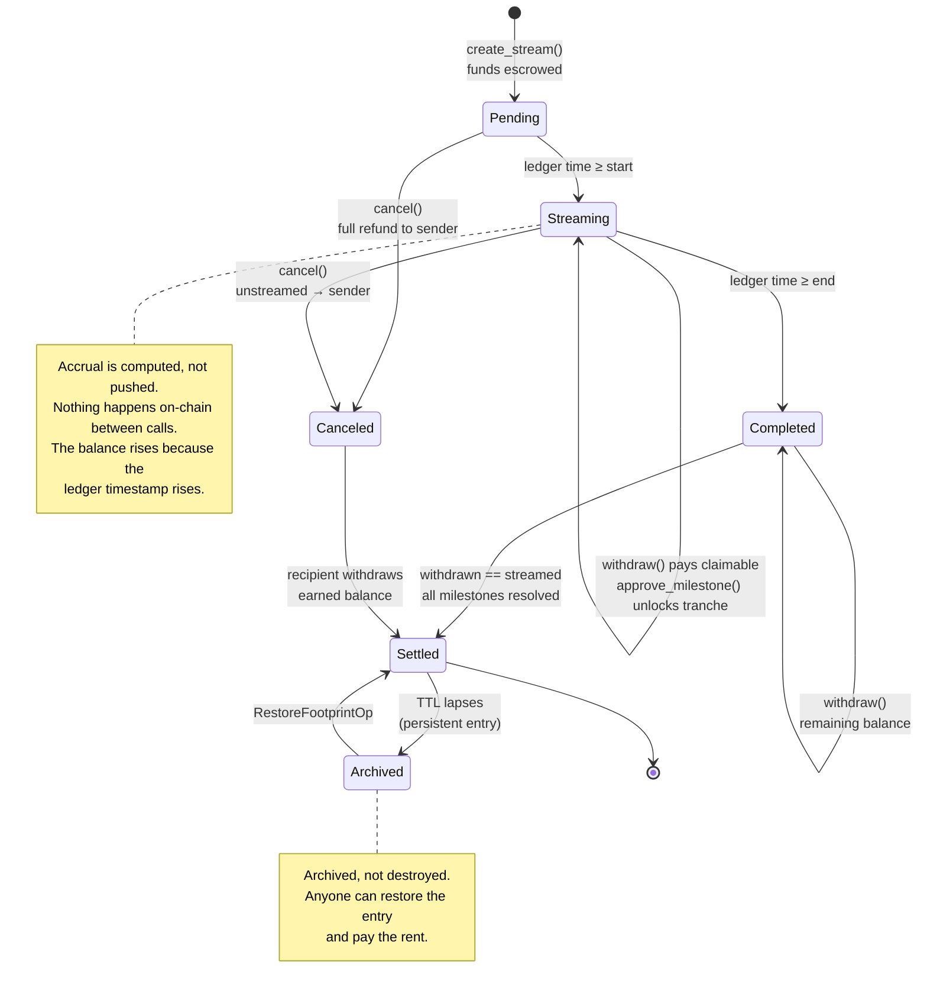

# Architecture

This describes the intended system and the reasoning behind it. **None of it is implemented.** Where a number or an interface is still undecided, there is a TODO rather than a guess.

Read [concepts.md](concepts.md) first if "streamed vs. claimable" isn't already obvious to you.

## Components

Four pieces. Only the first one is trusted.

### 1. StelFlow Core (Soroban contract, Rust) — planned

Holds custody, owns the accrual math, and is the only component that can move money. Everything else is a view of it.

Responsibilities:

- Create a stream: pull the full deposit from the sender, write stream state, emit an event.
- Compute claimable balance on read, from ledger time.
- Withdraw: pay the recipient what the formula allows, update the withdrawn counter.
- Milestones: let a named approver mark a tranche met, which unlocks it.
- Cancel: freeze accrual, leave the recipient's earned balance withdrawable, return the remainder to the sender.

Non-responsibilities, deliberately: no dispute resolution, no identity, no asset issuance, no fee-on-transfer logic, no scheduling. If a feature can live off-chain or in an escrow contract, it does.

<!-- TODO(maintainer): decide whether Core is one contract or split (streams + registry). Splitting costs a cross-contract call per withdrawal and eats into the read budget; keeping it monolithic makes upgrades coarser. Needs a decision before Phase 1. -->

### 2. Indexer (off-chain) — planned

Soroban contracts can emit events, but they cannot be queried historically from inside the chain, and RPC retains event history for a limited window only. Anything that answers "show me every stream this address has ever received" has to be reconstructed off-chain.

The indexer subscribes to StelFlow's contract events via Stellar RPC, writes them to a database, and serves queries the contract can't: stream lists by participant, historical withdrawal timelines, aggregate treasury outflow, milestone approval audit trails.

It is a cache, not an authority. If the indexer and the chain disagree, the chain is right. The dashboard must be able to show a stream's current claimable balance without the indexer being up — that number comes from simulating a contract read, not from the database.

<!-- TODO(maintainer): choose the runtime and datastore, and decide the RPC event-retention backstop (RPC keeps a bounded window, so a cold-start reindex needs an archive source). Record the choice here. -->

### 3. TypeScript SDK — planned

The layer application developers actually touch. Typed bindings generated from the contract spec, plus the things raw bindings don't give you:

- **Accrual preview without a round trip.** The claimable formula is pure arithmetic over stream state. Once the SDK has the state, it can recompute claimable locally every second for a live-updating UI, instead of hammering RPC. The contract stays the authority at withdrawal time.
- **Transaction assembly** — build, simulate, and submit, with the auth entries a withdrawal needs.
- **Indexer client** for history.

### 4. React dashboard — planned

Create streams, watch them accrue, withdraw, approve milestones, cancel. Three views because there are three roles: sender, recipient, approver.

## Data flow

Creating a stream:

1. Sender approves StelFlow Core to move `total` of a SEP-41 asset (or the SDK bundles the approval).
2. Sender calls `create_stream`. The contract calls `transfer_from` on the asset, taking full custody up front. A stream that isn't fully funded at creation is not a stream — it's a promise, and the point is to remove promises.
3. The contract writes stream state and emits a creation event.
4. The indexer picks up the event and materializes the stream. The dashboard shows it.

Withdrawing:

1. The SDK computes the expected claimable amount locally and shows it.
2. Recipient submits `withdraw`. The contract recomputes from its own ledger timestamp — the local number is a display, never an input to settlement.
3. Contract transfers the asset, bumps the withdrawn counter, extends the entry's TTL, emits an event.

The important property: **no off-chain component is on the critical path for getting paid.** If the indexer and the dashboard both disappear, a recipient with the contract address and a wallet can still withdraw everything they're owed.

## Stream lifecycle

A cliff does not appear as a state. It's a predicate inside the claimable calculation — during a cliff the stream is `Streaming` and accruing, but `claimable` evaluates to 0.

## How Soroban shapes the design

This is the part that matters. Streaming is easy; streaming *on this chain* has four specific constraints that dictate the storage layout and the API.

### Ledger time is the clock

`env.ledger().timestamp()` returns the close time of the ledger executing the transaction, in seconds since the Unix epoch. There is no block number to count and no way to schedule a future call — Soroban has no cron, no keepers, no self-scheduling. That is precisely why a *computed* stream is the right shape here: the contract never needs to wake up. It only needs to answer correctly whenever someone asks.

Consequences to design around:

- **Resolution is a ledger, not a second.** Stellar closes ledgers every few seconds, so two withdrawals in the same ledger see an identical timestamp and the second one is a no-op. That's correct behavior, but the SDK should avoid presenting sub-ledger precision as if it were real.
- **Timestamps are consensus values, not wall clocks.** They are non-decreasing and closely tracked to real time, but a stream's boundaries should always be clamped (`clamp(now, start, end)`) rather than assumed in range.
- **Simulation time ≠ execution time.** A simulated read gives the claimable balance at the current ledger; by the time the transaction lands, a little more has accrued. Withdrawal must therefore be "withdraw what's available," not "withdraw exactly N" — or a stream would fail whenever the amount moved under it.

### Arithmetic

Balances are `i128`. Accrual is `total * elapsed / duration`, and the multiplication must come first — dividing first throws away the entire fractional rate for typical 7-decimal assets. `total * elapsed` can be large (a 10^15-stroop stream over a 10^9-second range is ~10^24), which fits `i128` comfortably but not `i64`, so the intermediate type is not optional.

Rounding is always down, and the withdrawn counter is the source of truth for what's been paid. Recomputing `streamed` from scratch each time and subtracting `withdrawn` means rounding error can't accumulate across withdrawals — the final withdrawal settles to exactly `total` because the end-of-stream case is special-cased to the remaining balance rather than the formula.

### Storage type and TTL

Soroban has three storage types, and picking wrong here is fatal:

| Type | Behavior when TTL lapses | Fit for stream state |
|---|---|---|
| `temporary` | **Permanently deleted.** Unrecoverable. | No. Deleting a stream deletes custody records for real money. |
| `instance` | Archived with the contract; every entry loads on every call. | No. All streams would share one entry and every call would pay to load all of them. |
| `persistent` | Archived, restorable via `RestoreFootprintOp`. | Yes. |

So: **one `persistent` entry per stream, keyed by stream ID.** Contract-wide config goes in `instance` storage, because it's small and needed on every call.

The real design pressure is that persistent entries still have a TTL and streams are long-lived. A 4-year vesting stream with a 1-year cliff will sit untouched for longer than a default TTL window. The design has to handle this rather than hope:

- Every state-changing call (`withdraw`, `approve_milestone`) calls `extend_ttl` on the stream's entry. Active streams keep themselves alive for free.
- Long-dormant streams *will* archive. That is acceptable, not a bug: archival preserves the entry, and a `RestoreFootprintOp` brings it back. The recipient pays a restore fee and withdraws. Nothing is lost.
- The SDK must detect an archived entry and produce a restore-then-withdraw flow, not a confusing "stream not found." This is the single most likely source of bad UX in the project and it needs to be handled in the SDK, not left to the app developer.
- A `bump_stream` entry point lets anyone extend any stream's TTL, so a sender or a watcher service can keep a dormant stream hot without the recipient acting.

<!-- TODO(maintainer): pick target TTL extension thresholds (extend_to / threshold ledgers) once you've priced rent for a realistic stream count. These are tunable and network-dependent, so they belong in config, not constants. -->

### The per-transaction read budget

A Soroban transaction declares a footprint and is capped on how many ledger entries it may read and write. Those caps are network settings, not compile-time constants — they've been raised repeatedly (100 read entries and 50 writes after SLP-0001 in early 2025; SLP-0004, finalized January 2026, takes disk reads and writes to 200 entries each and instructions to 400M). Check the live values with `stellar network settings` rather than trusting any number written in a doc, including this one.

The design implication survives whatever the current number is: **per-stream entries mean batch operations are bounded, so bound them explicitly.**

- One stream = one persistent entry, plus the asset contract's own entries for the transfer, plus the contract instance. A batch withdrawal across N streams therefore costs roughly N entries plus fixed overhead — the read cap sets a hard ceiling on N.
- Milestones live **inside** the stream struct, not as separate keyed entries. Storing them separately would make a withdrawal on a 5-milestone stream read 6 entries instead of 1, and would cap batch sizes five times lower. The cost is that the stream entry gets bigger and every withdrawal deserializes all of a stream's milestones — a fair trade at realistic milestone counts.
- Therefore: **a hard cap on milestones per stream**, enforced at creation. An unbounded vector inside a stored struct is a way to build a stream that can never be withdrawn from, because reading it exceeds the transaction's resource budget. The cap must be low enough that a fully-loaded stream is comfortably withdrawable.
- Any batch entry point (`withdraw_many`, `bump_many`) takes a bounded vector and documents its maximum. The SDK chunks larger sets into multiple transactions rather than letting a transaction fail on resource limits.

<!-- TODO(maintainer): set MAX_MILESTONES_PER_STREAM and MAX_BATCH_SIZE. These need measurement against real limits, not a guess — derive them in Phase 1 from actual footprint sizes. -->

### SEP-41 assets

StelFlow streams anything implementing the [SEP-41 token interface](https://github.com/stellar/stellar-protocol/blob/master/ecosystem/sep-0041.md), which includes the Stellar Asset Contract — so any classic Stellar asset, USDC included, works via its SAC wrapper, alongside purpose-built Soroban tokens.

What this buys: one integration path for both asset families, and `i128` balances that match the internal math.

What it costs, and what the contract must not assume:

- **SEP-41 is still a Draft SEP.** It's stable in practice and the SAC implements it, but the contract should depend only on the functions it actually calls (`transfer`, `transfer_from`, `balance`, `decimals`) rather than the full surface.
- **Issuer clawback is out of scope and cannot be defended against.** If an asset has clawback enabled, its issuer can remove funds the contract is holding for a live stream. The contract should not pretend its stored `total` is a guarantee — `balance` is the truth. The dashboard should warn when a stream's asset has clawback enabled. This is a disclosure problem, not a code problem.
- **Decimals are the asset's, not ours.** All internal math is in the asset's smallest unit. Human-readable formatting happens in the SDK, never in the contract.
- **Non-standard transfer behavior breaks accrual accounting.** A fee-on-transfer or rebasing token would leave the contract holding less than the stream promises. <!-- TODO(maintainer): decide whether create_stream verifies received balance against the requested total, or whether unsupported assets are simply documented as unsupported. -->

### Authorization

Every privileged entry point calls `require_auth` on the address that should be authorizing it — sender for `create_stream` and `cancel`, recipient for `withdraw`, approver for `approve_milestone`. Roles are stored per stream; there is no global admin over user funds. This also means an approver can be a contract address, which is how a Trustless Work escrow can act as the approver for a milestone.

## Trustless Work integration

[Trustless Work](https://docs.trustlesswork.com/) is escrow-as-a-service on Soroban, with milestones, approvals, and disputes already built. StelFlow is not trying to replace it, and shouldn't.

The intended split: Trustless Work decides *whether* a condition is met; StelFlow decides *how fast* money moves once it is. A grant program runs its approval and dispute process in a Trustless Work escrow, and that escrow's address is the approver on the StelFlow stream's milestones. The recipient draws a continuous base stream throughout, and gated tranches unlock as the escrow resolves them.

<!-- TODO(maintainer): confirm against Trustless Work's current API whether their escrow can make a cross-contract call into an arbitrary approver interface, or whether integration has to be driven by an off-chain agent watching their events. This determines whether the integration is trust-minimized or merely convenient — and it's a load-bearing claim, so verify before it goes in a grant application. -->

## Open questions

Answers wanted. These are good places to argue with the design — open an issue.

1. **Stream IDs.** Monotonic `u64` counter, or a hash of the creation parameters? A counter needs a writable global entry on every creation, which is a write-contention point. A hash is contention-free but unfriendly to read.
2. **Milestone revocation.** Can an approver un-approve? If so, what about funds already withdrawn under the approval? (Also flagged in [concepts.md](concepts.md).)
3. **Multiple recipients per stream.** Splitting a stream N ways is a real payroll need, but it multiplies the per-transaction entry cost. Probably out of scope for v1 — argue otherwise if you disagree.
4. **Upgradeability.** Soroban contracts can upgrade their own Wasm. For a custody contract, who holds that key, and is it worth the trust cost? A non-upgradeable contract with a documented migration path may be the better answer.
5. **Pausing.** Is there an emergency stop, and if so, can it stop *withdrawals*? An emergency stop that can freeze a recipient's earned funds is a rug vector with good intentions.

## Next

- [../ROADMAP.md](../ROADMAP.md) — build order.
- [../CONTRIBUTING.md](../CONTRIBUTING.md) — how to pick something up.
