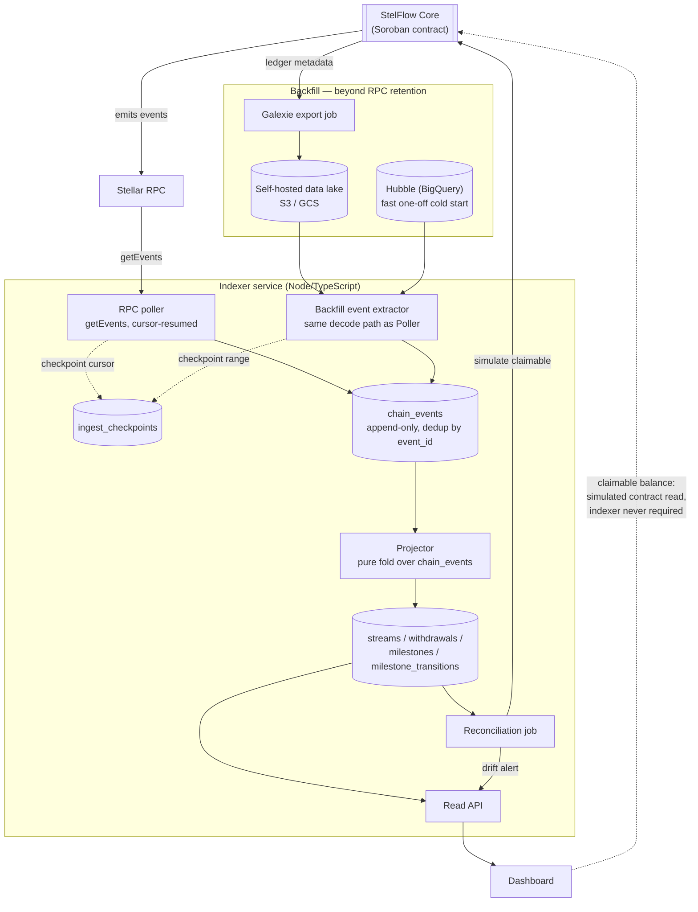

# Indexer design

This resolves the design work [docs/architecture.md § 2](../architecture.md#2-indexer-off-chain) deferred: runtime and datastore, the RPC event-retention backstop, and the cursor/reorg/idempotency mechanics that make [Phase 3](../../ROADMAP.md#phase-3--indexer-) rebuildable. Nothing here is implemented — this is the decision record Phase 3 builds against.

**Ground rule, repeated because it constrains every choice below:** the indexer is a cache, never an authority. If the indexer disagrees with the chain, the chain is right, and the dashboard's headline claimable-balance number must come from simulating a contract read, not from this database. Everything the indexer stores is for history, lists, and aggregates — things the contract genuinely cannot answer about itself.

## 1. Polling vs. streaming

This isn't really a choice. Stellar RPC exposes `getEvents` and `getLedgers` as request/response endpoints only — there is no subscription or push channel (no websocket equivalent of an EVM `eth_subscribe("logs")`). Anything that looks like "streaming" at the application layer is still a poll loop underneath; the only question is how tightly it polls and how it paginates.

`getEvents` mechanics that shape the loop:

- Pass either `startLedger`/`endLedger` **or** an opaque `cursor`, never both. After the first successful call, always resume from `cursor` — it's what keeps pagination correct across a single request's internal ledger-scan cap.
- One request scans at most 10,000 ledgers and returns at most 10,000 events (`limit`, default 100). A quiet contract never hits either cap; a busy one needs multiple pages per poll tick.
- The response's `latestLedger` / `latestLedgerCloseTime` tell the poller how far behind the RPC node's own view of the chain it is — track this as ingestion-lag telemetry, not just the poller's own clock.
- Ledgers close roughly every 5 seconds. A poll interval in the 3-8 second range keeps the indexer close to real-time without hammering the RPC endpoint; there's no benefit to polling faster than ledgers close.

**Recommendation:** a single continuous poll loop against `getEvents`, cursor-resumed, no separate "streaming" component. Treat interval and page size as config, not constants — RPC providers set their own rate limits.

## 2. Datastore

The write pattern is append-heavy (one row per contract event, never updated) with time-range and participant-filtered reads (a stream's withdrawal timeline, a recipient's stream list, treasury outflow over a window). That's an unglamorous OLTP shape, not an analytics one.

| Option | Fit | Verdict |
|---|---|---|
| **PostgreSQL** | Transactional upserts for idempotent ingestion, mature time-range indexing (BRIN/btree on `ledger_close_time`), JSONB for decoded event payloads without a migration per event type, one well-understood operational story. | **Recommended.** |
| **TimescaleDB / ClickHouse** | Built for exactly this write pattern at much higher volume, but StelFlow's event rate (one contract, per-stream state changes) doesn't come close to needing columnar storage or hypertables yet. Adds an operational dependency the project doesn't need in Phase 3. | Revisit only if reconciliation/analytics queries become the bottleneck — and Timescale is a Postgres extension, so that path doesn't require a rewrite. |
| **DynamoDB / Mongo** | No natural fit for "give me every withdrawal for this stream between two ledgers" without a secondary index that duplicates Postgres's btree for free. Loses transactional guarantees the checkpoint design below depends on. | Not recommended. |

**Runtime:** Node.js/TypeScript. The indexer decodes the same contract events the [SDK](../architecture.md#3-typescript-sdk--planned) will have typed bindings for — sharing the decode path and event types between indexer and SDK avoids a second, drifting implementation of "what does a `withdraw` event look like." A typed query layer over Postgres (e.g. Drizzle) keeps the schema below and the TypeScript types it's the same language as the rest of the stack.

## 3. Cursor and checkpoint design

Every event `getEvents` returns carries an `id` — a TOID (ledger sequence, transaction index, operation index, event index packed into one lexicographically sortable string). It is globally unique and totally ordered. That single field carries almost the entire reliability design:

- **Dedup key.** `chain_events.event_id` is the primary key. Ingestion is `INSERT ... ON CONFLICT (event_id) DO NOTHING`. Processing the same event twice — same poll page fetched again after a crash, an overlapping backfill range, a retried request — inserts nothing the second time. This is the literal mechanism behind "reprocessing the same event twice must not double-count."
- **Ordering key.** Because it's monotonic within and across ledgers, `event_id` also orders replay: folding `chain_events` by ascending `event_id` reproduces the exact sequence the contract emitted them in, regardless of what order rows physically landed in the table.
- **What gets persisted to resume.** `ingest_checkpoints` holds one row per ingestion source (`rpc_poller`, plus one per backfill job while it runs): `last_ledger_sequence`, `last_cursor` (the opaque RPC token, not something the indexer parses), `updated_at`. The checkpoint update commits in the **same transaction** as the event rows it follows — never checkpoint past data that isn't durably written, or a crash between the two leaves the poller resuming past events it never actually stored.

## 4. Idempotency, explicitly

Deduping raw events isn't sufficient by itself — the materialized `streams` row also has to end up correct no matter how many times a given event is folded into it. Two things make that hold:

1. **Contract events carry absolute state, not deltas.** A `withdraw` event should emit the resulting `withdrawn` total (and a `milestone_approved` event the resulting status), not "+N". Applying the same absolute-value event twice sets the same value twice — a no-op the second time, by construction, with no counter to accidentally increment. This is a requirement on the Phase 1 event design ([ROADMAP Phase 1](../../ROADMAP.md#phase-1--contract-core-) already flags "events designed for the indexer before the indexer exists" — this is what that needs to mean).
2. **Projection is guarded by a monotonic watermark.** Each materialized row (`streams.last_applied_event_id`, `milestones.last_applied_event_id`) only accepts an incoming event if its `event_id` is greater than the one already applied. Combined with (1), reprocessing, out-of-order delivery within a backfill range, or replaying the entire log from scratch all converge to the identical final row.

Net effect: idempotency isn't a dedup step bolted onto ingestion, it's a property of the fold function itself. See [§7](#7-rebuildability) — this is also what makes rebuild-from-scratch safe.

## 5. Rollback / finality handling, explicitly

Stellar's consensus (SCP) gives deterministic finality once a ledger closes and is confirmed by quorum — there is no probabilistic reorg risk the way there is on proof-of-work chains; a closed Stellar ledger does not get replaced by a competing one under normal operation. So "the ledger not being final at read time" isn't a protocol-level reorg risk here. The residual risk is one layer down, at the RPC provider:

- A single RPC node can be behind the network tip, mid-restart, or briefly serving from a stale snapshot during catch-up.
- Switching RPC providers (failover, load balancing) can momentarily present a different view if the two nodes aren't equally caught up.

Neither of those is a chain rollback, but both can make the indexer briefly disagree with a moment later than it should. The design treats this as cheap insurance rather than a hard problem:

- Track `latest_seen_ledger` (whatever the poller has ingested) separately from `latest_confirmed_ledger = latest_seen_ledger - CONFIRMATION_LEDGERS`, where `CONFIRMATION_LEDGERS` is a small config value (starting point: 2 — about 10 seconds at Stellar's close rate). This mirrors the pattern architecture.md already uses for tunables: "these are tunable and network-dependent, so they belong in config, not constants."
- `chain_events` rows carry a `confirmed` flag, flipped once their ledger passes the confirmation depth. Reconciliation (§8) and any aggregate/analytics read use `confirmed` data; low-latency UI reads (e.g. "your withdrawal was seen") can use unconfirmed data if the caller explicitly wants optimism over certainty.
- No explicit "undo" path exists, and none is needed: because ingestion is idempotent and projection is a pure fold over an ordered, deduplicated log (§4), the correct response to any inconsistency — RPC gave conflicting data, a provider was switched, a bug is fixed — is the same rebuild procedure as a cold start, not bespoke rollback logic.

## 6. Rebuildability

ROADMAP's Phase 3 done-condition is that wiping the database and replaying reaches identical state. That's only true if the schema is structured so replay is a pure function of the event log, which is why the schema (§9) splits into two layers:

- **`chain_events`** — append-only, the actual source of truth for replay. Never mutated, only inserted (deduped by `event_id`).
- **Everything else** (`streams`, `withdrawals`, `milestones`, `milestone_transitions`) — derived, rebuilt by folding `chain_events` in `event_id` order. Nothing ever writes to these tables except the projector, and the projector's only input is `chain_events`.

Rebuild procedure: truncate the derived tables and `ingest_checkpoints`, then re-run the projector over the existing `chain_events` rows in order. This doesn't even require re-hitting RPC or the backfill source if `chain_events` already holds the full history — it's a local, deterministic replay. A full cold rebuild (wipe `chain_events` too) re-runs backfill (§7) followed by the live poller, which lands on the same `chain_events` rows because ingestion is deduped and ordered the same way regardless of source.

## 7. Backfill strategy

Stellar RPC's event retention is a bounded window (commonly quoted as 7 days, but that's an operator-configured `retention-window` setting, not a protocol guarantee — verify it against the specific RPC endpoint in use rather than trusting a number in this doc). A cold start reaching further back than that, or a gap caused by extended indexer downtime, needs a source that isn't live RPC.

**Recommended: [Galexie](https://developers.stellar.org/docs/data/indexers/build-your-own/galexie).** SDF's supported extractor pulls raw ledger metadata (XDR) from the network into a self-hosted data lake (S3 or GCS), for an arbitrary historical ledger range or continuously. The indexer runs the *same* event-decoding logic against Galexie-exported ledger metadata that it runs against live `getEvents` responses, and produces the same `chain_events` rows with the same `event_id` — so a backfilled event and a live-polled event are indistinguishable to the dedup/idempotency machinery in §4. Self-hosting means the backfill path doesn't depend on an SDF-operated service staying free or staying up.

**Fallback for a fast first cold start: [Hubble](https://developers.stellar.org/docs/data/analytics/hubble)**, SDF's public BigQuery dataset (itself now backed by a Galexie-exported data lake). A one-off SQL export of the relevant ledger range is much less infrastructure than standing up Galexie, and is the pragmatic choice for the very first backfill before the project has its own Galexie pipeline running. It is not the recurring path — treat it as bootstrap tooling, not a dependency the running indexer takes on BigQuery for.

Backfill jobs get their own `ingest_checkpoints` row (a ledger range rather than a live cursor) so a backfill can be paused, resumed, or re-run without touching the live poller's checkpoint.

This resolves the TODO in [docs/architecture.md § 2](../architecture.md#2-indexer-off-chain): **Galexie-backed self-hosted backfill, with Hubble as the fast one-off cold-start path**, both feeding the same decode-and-dedup pipeline live polling uses.

## 8. Reconciliation against on-chain state

[SECURITY.md](../../SECURITY.md#scope) scopes "the indexer, where a flaw causes it to report balances that don't match the chain" as a reportable bug — reconciliation is what catches that before a bug report does.

A periodic job (interval TBD at implementation, starting point: every few minutes) walks confirmed streams, calls the contract's claimable-balance simulation for each — the same read path the SDK's accrual preview and the dashboard's degraded mode use — and compares it against the indexer's own recomputation of claimable from its materialized `streams` row. The formula is deterministic, so a mismatch beyond rounding is drift, not noise: it flags `streams.drift_detected = true`, records the observed vs. expected values in `reconciliation_runs`, and surfaces an alert.

What reconciliation is explicitly *not*: a data source. Its output feeds a "this stream's indexed data may be stale" badge, and it's how someone chasing a SECURITY.md report finds the divergence — it never substitutes for the contract read that the dashboard uses to show a number the user might act on. That's the ground rule again: **the dashboard must be able to show a correct claimable balance with the indexer down**, because that number comes from simulating a contract read, never from this database.

## 9. Architecture



The dotted edge is load-bearing: it's the ground rule drawn as a diagram. Every solid path into the dashboard is convenience — history, lists, aggregates. The one number that must survive the indexer being completely down bypasses this entire system.

## 10. Schema

```sql
-- Append-only raw event log. The only table backfill and live polling both
-- write to, and the only table replay reads from. Never updated in place.
CREATE TABLE chain_events (
    event_id            TEXT PRIMARY KEY,        -- TOID: globally unique, totally ordered
    ledger_sequence     BIGINT NOT NULL,
    ledger_close_time   TIMESTAMPTZ NOT NULL,
    tx_hash             TEXT NOT NULL,
    contract_id         TEXT NOT NULL,
    event_type          TEXT NOT NULL,            -- stream_created | withdrawal | milestone_approved | stream_canceled | ttl_bumped | ...
    topic               JSONB NOT NULL,            -- decoded topic segments
    payload             JSONB NOT NULL,            -- decoded event body; carries absolute state, see §4
    source              TEXT NOT NULL,             -- 'rpc' | 'galexie_backfill' | 'hubble_backfill'
    confirmed           BOOLEAN NOT NULL DEFAULT false,
    ingested_at         TIMESTAMPTZ NOT NULL DEFAULT now()
);
CREATE INDEX chain_events_ledger_idx ON chain_events USING BRIN (ledger_close_time);
CREATE INDEX chain_events_contract_type_idx ON chain_events (contract_id, event_type, ledger_sequence);

-- Resume state per ingestion source. Committed in the same transaction as
-- the chain_events rows it follows — see §3.
CREATE TABLE ingest_checkpoints (
    source              TEXT PRIMARY KEY,          -- 'rpc_poller', or a backfill job id
    last_ledger_sequence BIGINT NOT NULL,
    last_cursor         TEXT,                       -- opaque RPC pagination token
    updated_at          TIMESTAMPTZ NOT NULL DEFAULT now()
);

-- Materialized stream state. Written only by the projector folding
-- chain_events; last_applied_event_id is the idempotency watermark (§4).
CREATE TABLE streams (
    stream_id            TEXT PRIMARY KEY,
    sender                TEXT NOT NULL,
    recipient              TEXT NOT NULL,
    asset_contract        TEXT NOT NULL,
    total                  NUMERIC(39, 0) NOT NULL, -- i128-safe (max i128 is 39 digits)
    start_time             TIMESTAMPTZ NOT NULL,
    end_time               TIMESTAMPTZ NOT NULL,
    cliff_time             TIMESTAMPTZ,
    cancelable             BOOLEAN NOT NULL,
    withdrawn              NUMERIC(39, 0) NOT NULL DEFAULT 0,
    status                 TEXT NOT NULL,           -- pending | streaming | canceled | completed | settled | archived
    drift_detected         BOOLEAN NOT NULL DEFAULT false,
    last_applied_event_id  TEXT NOT NULL,
    created_at_ledger       BIGINT NOT NULL,
    updated_at_ledger       BIGINT NOT NULL
);
CREATE INDEX streams_sender_idx ON streams (sender);
CREATE INDEX streams_recipient_idx ON streams (recipient);

-- Withdrawal timeline. Append-only history, one row per withdrawal event —
-- this table is a log, not a mutated aggregate.
CREATE TABLE withdrawals (
    event_id             TEXT PRIMARY KEY REFERENCES chain_events (event_id),
    stream_id             TEXT NOT NULL REFERENCES streams (stream_id),
    recipient              TEXT NOT NULL,
    amount                 NUMERIC(39, 0) NOT NULL, -- delta paid in this withdrawal
    withdrawn_total_after  NUMERIC(39, 0) NOT NULL, -- absolute value the event carried, see §4
    ledger_sequence         BIGINT NOT NULL,
    ledger_close_time       TIMESTAMPTZ NOT NULL
);
CREATE INDEX withdrawals_stream_time_idx ON withdrawals (stream_id, ledger_close_time);

-- Current milestone state, inline per stream to mirror the contract's own
-- storage shape (architecture.md § storage type and TTL).
CREATE TABLE milestones (
    stream_id             TEXT NOT NULL REFERENCES streams (stream_id),
    milestone_index         INT NOT NULL,
    approver                TEXT NOT NULL,
    amount                   NUMERIC(39, 0) NOT NULL,
    status                   TEXT NOT NULL,          -- unmet | met
    approved_at_ledger        BIGINT,
    last_applied_event_id     TEXT NOT NULL,
    PRIMARY KEY (stream_id, milestone_index)
);

-- Milestone approval audit trail. Append-only, distinct from the current-
-- state table above so "who approved what, when" survives even if a
-- milestone's current status is later disputed.
CREATE TABLE milestone_transitions (
    event_id             TEXT PRIMARY KEY REFERENCES chain_events (event_id),
    stream_id             TEXT NOT NULL REFERENCES streams (stream_id),
    milestone_index         INT NOT NULL,
    approver                TEXT NOT NULL,
    ledger_sequence          BIGINT NOT NULL,
    ledger_close_time        TIMESTAMPTZ NOT NULL
);

-- Reconciliation output (§8). Not read by anything user-facing except an
-- alert/badge — never a substitute for a contract read.
CREATE TABLE reconciliation_runs (
    id                    BIGSERIAL PRIMARY KEY,
    stream_id              TEXT NOT NULL REFERENCES streams (stream_id),
    run_at                  TIMESTAMPTZ NOT NULL DEFAULT now(),
    indexer_claimable        NUMERIC(39, 0) NOT NULL,
    chain_claimable          NUMERIC(39, 0) NOT NULL,
    drifted                  BOOLEAN NOT NULL,
    details                  JSONB
);
```

## 11. What this doesn't settle

- Exact `CONFIRMATION_LEDGERS` and reconciliation interval values — tunable, and like the TTL and batch-size thresholds in architecture.md, they belong in config once there's a real deployment to measure against, not in this doc.
- The Read API's concrete shape (REST vs. GraphQL, pagination format) — out of scope here; this doc settles storage and ingestion, not the query surface.
- Whether contract events actually emit absolute state as §4 assumes — that's a Phase 1 contract-event-design decision this doc is making a requirement of, not something the indexer can retrofit if Phase 1 ships deltas instead.

## Next

- [architecture.md § 2](../architecture.md#2-indexer-off-chain) — the component this design resolves.
- [ROADMAP.md § Phase 3](../../ROADMAP.md#phase-3--indexer-) — the checklist this design is meant to unblock.
- [SECURITY.md § Scope](../../SECURITY.md#scope) — why reconciliation exists.
